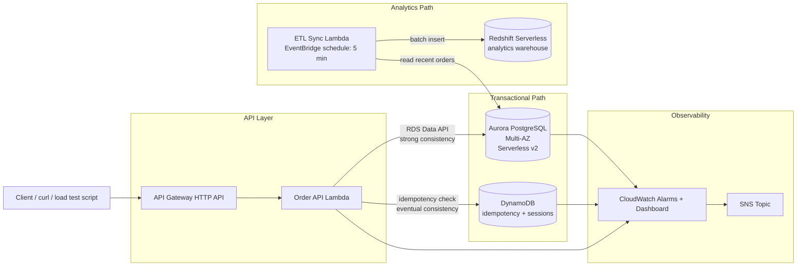

**Consistency tradeoff made explicit:**
- Aurora is used for the order record itself: strong consistency, ACID transactions, relational integrity (a financial/order record should never be "eventually" correct).
- DynamoDB is used for idempotency keys and session/cart state: default eventual consistency is an acceptable tradeoff here in exchange for single-digit-millisecond latency, since a rare duplicate-check miss only risks a harmless duplicate order rather than data corruption.
- Redshift is fed asynchronously and is allowed to lag the source of truth (Aurora) by minutes — OLAP workloads do not need real-time consistency with OLTP.
